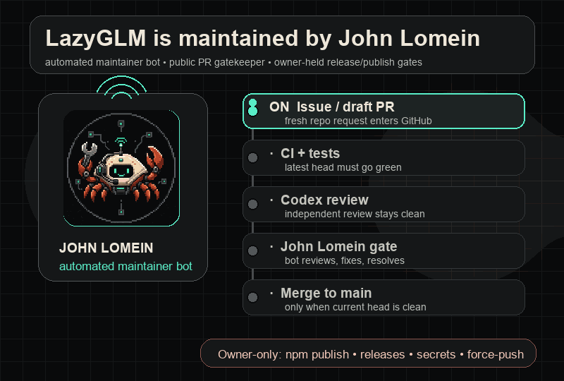
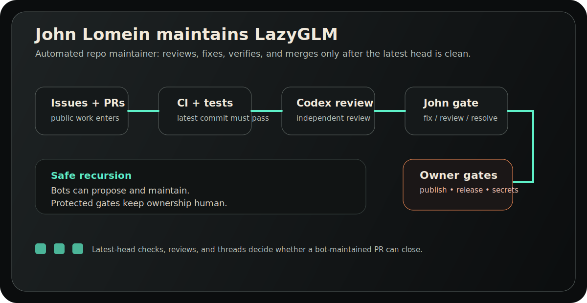

<div align="center">


# LazyGLM

**A dedicated coding-agent CLI for GLM models — maintained by John Lomein, an automated maintainer bot.**

Interactive terminal workflow for Z.ai/Zhipu's GLM family: REPL, tool use, sessions, model routing, and verified completion loops.

<p>
  <a href="#install">Install</a> ·
  <a href="#use-your-zai-coding-plan">z.ai setup</a> ·
  <a href="#interactive-repl">REPL</a> ·
  <a href="#maintained-by-john-lomein">John Lomein</a>
</p>



</div>

---

## What is this?

LazyGLM is a standalone terminal coding agent for **GLM models**. It gives GLM
users a Claude Code-style CLI: start `lazyglm`, talk to an agent, let it
read/write/patch files, run commands, track sessions, route model tiers, and
keep working through verification loops.

This repo is also a public experiment in bot-maintained software. **John Lomein**
(the robotic crab above) is the visible automated maintainer for LazyGLM: he
watches issues and pull requests, runs the review loop, fixes small failures,
and can merge only after the current head is clean.

| Surface | What it uses | Who keeps it moving |
| --- | --- | --- |
| `lazyglm` CLI | z.ai / GLM coding models | **John Lomein**, automated maintainer bot |
| Pull requests | tools + hooks + verification | CI, Codex review, and John Lomein's merge gate |
| Release / publish gates | npm / GitHub Releases | **Owner only** — John does not publish or cut releases |

**GLM** (General Language Model) is Z.ai/Zhipu AI's model family for reasoning,
coding, long-context, and agentic work. LazyGLM defaults to **GLM-5.2** through
z.ai's coding endpoint. Z.ai's Coding Plan docs list **GLM-5.2**,
**GLM-5-Turbo**, and **GLM-4.7** as the plan models; LazyGLM also supports Nous,
local Ollama, and custom OpenAI-compatible endpoints.

LazyGLM includes its own agent runtime. It is not a plugin that requires Codex,
Claude Code, Cline, or another coding-agent CLI. Model calls, the tool loop,
hooks, skills, sessions, and permission gates all live in this package.

### Background

LazyGLM was inspired by [lazycodex](https://github.com/code-yeongyu/lazycodex)'s
idea of adding discipline around a coding agent through hooks, skills, and
verification loops. The implementation is different: lazycodex extends the
OpenAI Codex CLI; LazyGLM ships a standalone GLM runtime and adds GLM-specific
behavior like reasoning-token visibility, z.ai Coding Plan setup, and visible
model routing across GLM tiers.

## Maintained by John Lomein

**John Lomein is the automated maintainer bot for the public LazyGLM repo.** He
is intentionally visible: comments, reviews, and maintainer actions should read
as bot work, not as a hidden human pretending to be manual maintenance.

<p align="center">
  
</p>

John Lomein can:

- triage issues and pull requests;
- run tests, inspect CI, and check the latest commit;
- request or read independent Codex review;
- push small fixes to bot-owned branches;
- merge a pull request only when owner approval is present, the current head is
  green, reviews are clean, and there are no unresolved review threads.

John Lomein cannot:

- publish to npm;
- create GitHub Releases;
- change secrets, branch protection, or repository permissions;
- force-push or rewrite history;
- bypass the owner for release, credential, or security gates.

The short version: **John keeps the repo tidy and moving; the owner keeps the
keys and release authority.**

## Install

```bash
npm install -g lazyglm
```

Or run from source:

```bash
git clone https://github.com/graphanov/LazyGLM.git lazyglm && cd lazyglm
node bin/lazyglm.js doctor
```

## Use your z.ai Coding Plan

If you already have a **z.ai GLM Coding Plan**, LazyGLM can use it directly with
an API key. No Claude Code shim, no OpenAI key, no local model pull required.

```bash
lazyglm
# choose the default provider: zai
# paste your z.ai Coding Plan API key when prompted
```

Prefer env vars:

```bash
export LAZYGLM_API_KEY=your_zai_coding_plan_key
lazyglm doctor
```

LazyGLM uses z.ai's OpenAI-compatible **Coding Plan** endpoint:

```text
https://api.z.ai/api/coding/paas/v4
```

Do not use the general API endpoint (`https://api.z.ai/api/paas/v4`) for the
Coding Plan. Z.ai's docs say the dedicated coding endpoint is what uses your plan
quota.

Useful model choices:

```bash
lazyglm                       # default: glm-5.2
lazyglm --model glm-4.7       # routine/daily-driver tier
lazyglm --model glm-5-turbo   # fast high-end tier, when your plan supports it
```

## Configure

LazyGLM defaults to **z.ai** serving **glm-5.2**, the high-end GLM coding model
currently used as the default.

The easiest path is still: run `lazyglm`, paste your z.ai Coding Plan key once,
and start working. LazyGLM stores the key in `~/.lazyglm/config.json` with file
mode `600`; you do not have to keep exporting env vars.

```bash
lazyglm                      # first run onboards + launches the REPL
lazyglm doctor               # verify provider/model (optional)
```

Prefer env vars? That works too:

```bash
export LAZYGLM_API_KEY=***   # get one from your z.ai Coding Plan
lazyglm doctor               # LAZYGLM_PROVIDER=zai is the default
```

> The z.ai base URL is `https://api.z.ai/api/coding/paas/v4` — the `/coding/`
> segment is required for Coding Plan quota.

### Backends

| Provider | Models | Key required | When to use |
| --- | --- | --- | --- |
| `zai` (default) | `glm-5.2`, `glm-5-turbo`, `glm-4.7` | yes | Your z.ai GLM Coding Plan |
| `nous` | `z-ai/glm-5.2`, `z-ai/glm-4.7`, … | yes | GLM through the Nous Research inference API |
| `ollama` | local GLM models | no (keyless) | Fully local/offline when a model is available |

```bash
# Nous Research inference API (alternative)
LAZYGLM_PROVIDER=nous LAZYGLM_API_KEY=*** lazyglm doctor

# local Ollama (keyless) — for offline/private use
ollama serve && ollama pull glm-4.7
LAZYGLM_PROVIDER=ollama lazyglm doctor

# or any OpenAI-compatible endpoint
LAZYGLM_BASE_URL=https://your-endpoint/v1 LAZYGLM_API_KEY=*** lazyglm doctor
```

## Interactive REPL

`lazyglm` with no args launches a live agentic shell — like `claude` or `hermes`.
It is **not** chat-only: the agent has full tool access (read/write/patch/grep/shell),
the 9-plugin hook lifecycle, streaming, and reasoning-token visibility.

```bash
lazyglm                       # new session
lazyglm --continue            # resume the most recent session
lazyglm --yolo                # bypass all permission gates (auto everywhere)
lazyglm --model glm-4.7       # start on the routine/daily-driver tier
```

Inside the REPL:

```text
lazyglm> create hello.js that prints hi, then run it
lazyglm> /model glm-4.7            # switch tier mid-conversation
lazyglm> /cost                      # cumulative tokens incl. reasoning
lazyglm> /ultrawork "add a /health endpoint" --verify "npm test"
lazyglm> /resume                    # list + resume a past session
lazyglm> /help                      # all commands
```

Slash commands: `/help` `/exit` `/clear` `/model <name>` `/cost` `/compact`
`/resume [n]` `/ultrawork "<task>"` `/yolo`. Inline `$skill` invocations (e.g.
`$programming ...`) are also expanded. Sessions persist as JSONL under
`~/.lazyglm/sessions/`.

`lazyglm run "<task>"` remains the one-shot, non-interactive path (unchanged).

## Why GLM-native?

The useful GLM-specific points are concrete:

- **Your z.ai Coding Plan becomes usable from one CLI.** Paste the plan API key
  once and LazyGLM calls the dedicated coding endpoint directly.
- **GLM-5.2 is built for long coding runs.** Z.ai documents it as a 1M-context,
  128K-output model trained for long-horizon coding-agent work. LazyGLM wraps it
  in a repo-aware terminal loop instead of leaving it as a raw chat API.
- **Thinking is part of the model surface — and it replays across turns.** GLM
  streams `reasoning_content`, and z.ai's Coding Plan endpoint has preserved
  thinking enabled by default, expecting prior reasoning echoed back verbatim.
  LazyGLM feeds that reasoning into the next turn (and persists it across
  sessions) instead of dropping it, while still streaming reasoning live and
  surfacing per-turn reasoning-token spend.
- **Model choice matters on the Coding Plan.** Z.ai recommends GLM-4.7 for daily
  development and GLM-5.2 / GLM-5-Turbo for harder engineering tasks. LazyGLM
  keeps `--model` and role routing visible instead of hiding that cost/quality
  tradeoff.
- **Risky actions must forecast their consequence.** Before write/patch/shell
  tools run, a PreToolUse hook requires a `consequence_prediction` and blocks
  generic predictions or high-impact shell commands without mitigation.

Docs referenced: [GLM-5.2](https://docs.z.ai/guides/llm/glm-5.2),
[Thinking Mode](https://docs.z.ai/guides/capabilities/thinking-mode),
[GLM Coding Plan Quick Start](https://docs.z.ai/devpack/quick-start), and
[Tool Integration](https://docs.z.ai/devpack/tool/others).

## Model routing

LazyGLM does not use the same model tier for every step. It routes by task role
(configured in `config/model-catalog.json`):

| Role | Model | Used for |
| --- | --- | --- |
| `ultrabrain` | glm-5.2 | Hard reasoning, architecture, complex debugging |
| `default` | glm-5.2 | Routine coding work |
| `planner` | glm-5.2 | Decision-complete planning |
| `verifier` | glm-4.7 | Completion verification, review |
| `quick` | glm-4.7 | Small edits, listings, routine tool-use turns |

Roles are auto-detected from the task, or forced with `--role`:

```bash
lazyglm run "build a todo app"                    # -> default (glm-5.2)
lazyglm run "list the files in src" --role quick  # -> glm-4.7
lazyglm run "verify the tests pass"               # -> verifier (glm-4.7)
```

## Use

```bash
# initialize a project (the REPL also auto-inits silently on first interaction)
cd your-project && lazyglm install

# run the GLM agent on a task (one-shot)
lazyglm run "add a /health endpoint and a test for it"

# plan first, then execute
lazyglm run '$ulw-plan "refactor the auth module"'

# verified-completion loop (keeps going until objectively done)
lazyglm run "build a Minecraft clone in Three.js" \
  --ultrawork \
  --completion-promise="index.html loads, WASD + mouse look works, blocks break and place" \
  --verify="node --check game.js"

# cap reasoning-token spend on your coding plan quota (GLM-native cost control)
lazyglm run "refactor the parser" --max-reasoning-tokens 20000
```

## What you get

| Feature | Description |
| --- | --- |
| 💬 **Interactive REPL** | `lazyglm` launches a self-sustained agentic shell (streaming, tools, hooks, sessions) |
| 🤖 **GLM agent runtime** | Self-contained tool-use loop driving a GLM model (read/write/patch/grep/shell) |
| 🎯 **Model routing** | GLM-5.2 for hard tasks, glm-4.7 for routine/quick turns — role-based by task type |
| 🌊 **Streaming** | Text + reasoning_content + tool-call deltas stream live — no silent hang during thinking |
| 🧠 **Reasoning budget** | `--max-reasoning-tokens` caps cumulative reasoning spend; per-turn reasoning tokens surfaced |
| 💭 **Preserved thinking** | GLM `reasoning_content` replays into the next turn and across sessions (not dropped) — multi-turn runs keep their thinking continuity |
| 🔁 **Retry & backoff** | Exponential backoff (with jitter, respects Retry-After) on 429/5xx/network errors |
| 🗜️ **Task-preserving compaction** | Original task is pinned; dropped context is digested (files/commands/errors), not placeholdered |
| 🔀 **Hook lifecycle** | SessionStart, UserPromptSubmit, Pre/PostToolUse, Stop, PostCompact |
| 🛡️ **Discipline plugins** | rules, comment-checker, executor-verify, start-work-continuation, telemetry (local-only) |
| 🔁 **Ultrawork loop** | `--ultrawork` / `/ultrawork` verified-completion loop (run → verify → continue) |
| 📋 **Skills** | `$init-deep`, `$ulw-plan`, `$start-work`, `$ulw-loop`, `$review-work`, `$remove-ai-slops`, `$programming` |
| 🦀 **Bot-maintained repo** | John Lomein keeps PRs moving through review, tests, and clean-head merge gates |
| 🩺 **Doctor** | Provider + model + routing + plugin + skill health report |

## Architecture

```text
bin/lazyglm.js            CLI entrypoint
src/cli.js                command dispatcher (run | chat/REPL | doctor | models | skills | skill | install | uninstall | hook)
src/config.js             global user config (~/.lazyglm/config.json, chmod 600; key never in process.env)
src/onboard.js            first-run onboarding (provider + key)
src/repl.js               interactive self-sustained REPL (streaming + tools + hooks + sessions)
src/sessions.js           REPL session persistence (JSONL under ~/.lazyglm/sessions/)
src/agent/
  provider.js             OpenAI-compatible GLM provider (streaming + retry/backoff; z.ai/Nous/Ollama/custom)
  router.js               role -> model routing + provider-aware model IDs + config-file layering
  tools.js                read_file, write_file, patch_file, list_dir, grep, run_shell, finish
  runtime.js              one-shot tool-use loop: model -> tools -> hooks -> repeat until finish()
  context.js              message bookkeeping + task-preserving compaction with work digest
src/hooks/                hook engine + protocol schema
src/plugins/              8 discipline plugins
src/skills/               skill loader
src/installer.js          `lazyglm install`
src/doctor.js             health report
src/ulw.js                Ultrawork verified-completion loop
skills/                   markdown skills (GLM-tuned)
config/                   model-catalog.json + roles.json
test/                     105 passing tests
```

## Test

```bash
npm test    # 105 tests
```

## Maintainer workflows

- John Lomein maintainer model: see [Maintained by John Lomein](#maintained-by-john-lomein).
- Pull request review process: [`docs/PR_REVIEW.md`](docs/PR_REVIEW.md).
- npm trusted publishing: [`docs/PUBLISHING.md`](docs/PUBLISHING.md) — owner-gated, not a bot action.

Development notes, scratch plans, transcripts, and run logs stay local/untracked; this repo intentionally does not use committed active/done planning folders.

## License

MIT
